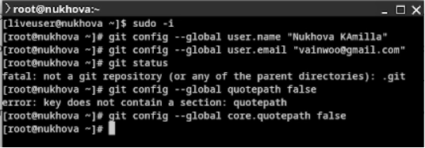
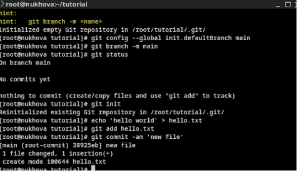
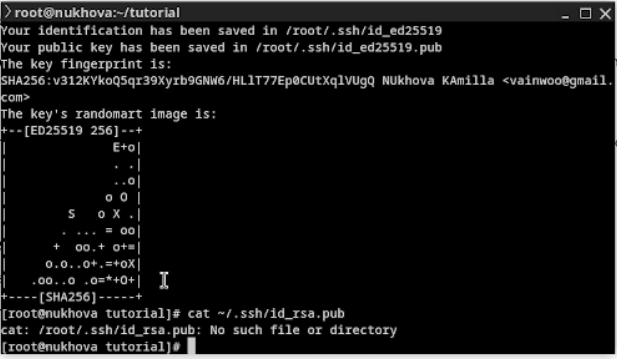
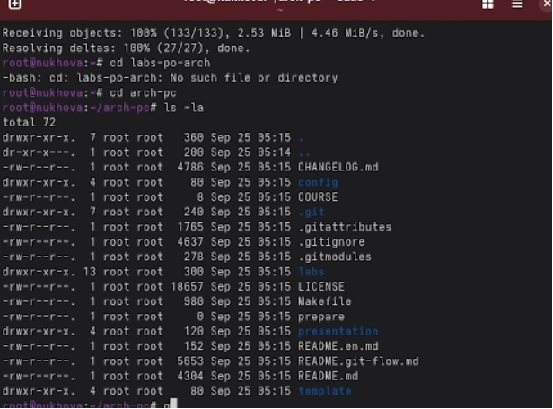

# Лабораторная работа №2  
Именованные каналы

---

## Цель работы

- Изучить идеологию контроля версий
- Освоить практические навыки работы с Git
- Научиться управлению версиями проектов

---

## Настройка Git

### Базовая конфигурация
git config --global user.name "Имя Фамилия"
git config --global user.email "work@mail"

---

## Создание репозитория

После инициализации в каталоге появляется `.git`:
- Хранит историю изменений
- Отслеживает версии файлов
- Управляет ветками

---

## Игнорирование файлов

### Настройка .gitignore
- Указывает шаблоны игнорируемых файлов
- Исключает временные файлы
- Оптимизирует репозиторий

---

## SSH ключи

### Безопасное подключение
- Создание ключей для аутентификации
- Безопасная работа с удаленными репозиториями
- Упрощение доступа к GitHub

---

## Завершение работы

---

## Вывод

- Освоили идеологию контроля версий
- Приобрели практические навыки работы с Git
- Научились настраивать локальный репозиторий
- Подготовили систему для работы с GitHub
