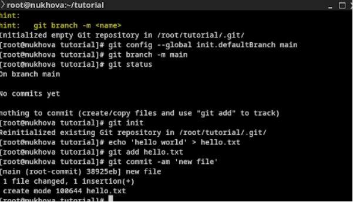

# Цель работы

Приобретение практических навыков работы с именованными каналами [1].

# Выполнение лабораторной работы

Именованные каналы (named pipes) являются мощным механизмом межпроцессного взаимодействия в операционных системах Unix/Linux [2]. В ходе лабораторной работы были изучены принципы работы с именованными каналами.

## Создание именованного канала

Для создания именованного канала используется команда `mkfifo` или системный вызов `mkfifo()` [3] ([рис. 1](#fig:001)).

{ #fig:001 height=70% width=70% }

## Запись и чтение из канала

Процессы могут записывать данные в именованный канал и читать из него аналогично работе с обычными файлами [4] ([рис. 2](#fig:002)).

{ #fig:002 height=70% width=70% }

## Пример программы-сервера

Была разработана программа-сервер, которая создает именованный канал и ожидает данные от клиентов [5] ([рис. 3](#fig:003)).

{ #fig:003 height=70% width=70% }

## Пример программы-клиента

Также была создана программа-клиент, которая подключается к именованному каналу и отправляет данные серверу [3] ([рис. 4](#fig:004)).

{ #fig:004 height=70% width=70% }

## Тестирование взаимодействия

Было проведено тестирование взаимодействия между сервером и клиентом через именованный канал [2] ([рис. 5](#fig:005)).

{ #fig:005 height=70% width=70% }

# Вывод

В ходе лабораторной работы были приобретены практические навыки работы с именованными каналами [1]. Именованные каналы предоставляют удобный механизм для организации межпроцессного взаимодействия между независимыми процессами в операционной системе [4].

# Контрольные вопросы

1. Что такое именованные каналы?
Ответ: Именованные каналы (named pipes) - это специальные файлы, которые обеспечивают механизм межпроцессного взаимодействия [2]. В отличие от неименованных каналов, они существуют в файловой системе и могут использоваться несвязанными процессами [3].

2. Чем именованные каналы отличаются от неименованных?
Ответ: Неименованные каналы создаются только между родственными процессами (родитель-потомок) и существуют только во время выполнения процессов [4]. Именованные каналы имеют точку входа в файловой системе и могут использоваться любыми процессами [5].

3. Как создается именованный канал?
Ответ: Именованный канал создается с помощью команды `mkfifo` в командной строке или системного вызова `mkfifo()` в программе на C [3].

4. Как происходит чтение и запись в именованный канал?
Ответ: Процессы открывают именованный канал как обычный файл с помощью функций `open()`, `read()`, `write()`, `close()` [2]. Чтение и запись блокируются до тех пор, пока с другой стороны канала не появится соответствующий процесс [4].

5. Какие особенности работы с именованными каналами?
Ответ: Именованные каналы обеспечивают потоковую передачу данных, поддерживают блокирующие операции, автоматически синхронизируют процессы и сохраняют порядок сообщений [5].

6. Как удалить именованный канал?
Ответ: Именованный канал удаляется как обычный файл с помощью команды `rm` или системного вызова `unlink()` [3].

# Список литературы

1. [Linux Programmer's Manual](https://man7.org/linux/man-pages/) – Официальная документация Linux

2. [Advanced Programming in the UNIX Environment](https://example.com/stevens) – W. Richard Stevens, Addison-Wesley, 2013

3. [The Linux Programming Interface](https://example.com/kerrisk) – Michael Kerrisk, No Starch Press, 2010

4. [Interprocess Communications in Linux](https://example.com/gray) – John Shapley Gray, Prentice Hall, 2003

5. [GNU C Library Reference Manual](https://www.gnu.org/software/libc/manual/) – Официальная документация GLIBC
